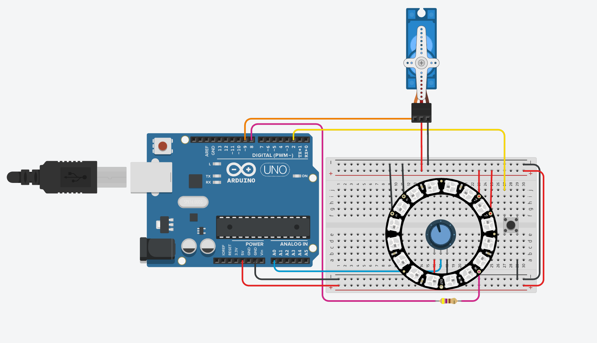

# Įvado į robotiką pirmasis projektas

[Tinkercad projektas](https://www.tinkercad.com/things/iEEMgT4lRwR-safe?sharecode=T2xjwmu5rqVCEO3duT6K68qx-YiC8bVKwyHPhdcpU_g)

## Aprašymas
Projekte įgyvendinta seifo spynos sistema. Spyna turi 12 pozicijų ir reikalauja 3 įvesčių, tad turi 1728 kombinacijas. Pozicijos yra pasirenkamos naudojantis potenciometru, o įvestis patvirtinama paspaudus mygtuką. Spyna indikuoja kiek įvesčių buvo pateikta su trimis mėlynomis lemputėmis. Įvedus trečią poziciją, Arduino patikrina, ar kombinacija teisinga. Jeigu ne, įjungia raudoną lemputę, išvalo kombinaciją ir leidžia bandyti vėl. Jeigu taip, įjungiama žalia lemputė ir pasukamas motoras, tokiu būdu atrakinant spyną.

## Nuotrauka

## Komponentų lentelė

|        Komponentas       | Kiekis |
|:------------------------:|:------:|
|      Arduino Uno R3      |    1   |
|     NeoPixel Ring 16     |    1   |
|   Maketavimo plok6telė   |    1   |
|   250K potenciometras    |    1   |
|         Mygtukas         |    1   |
| Pozicinis Servo variklis |    1   |
|     470R rezistorius     |    1   |

## Patobulinimai ateičiai
- Būdas vėl užrakinti seifą neperkraunant Arduino
- Galimybė pakeisti teisingą kombinaciją neperprogramuojant
- Stipresnis motoras (realybėje būtų nesunku pralaužti dabartinį)
